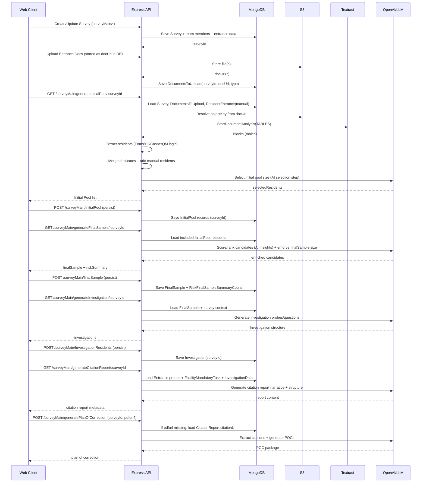
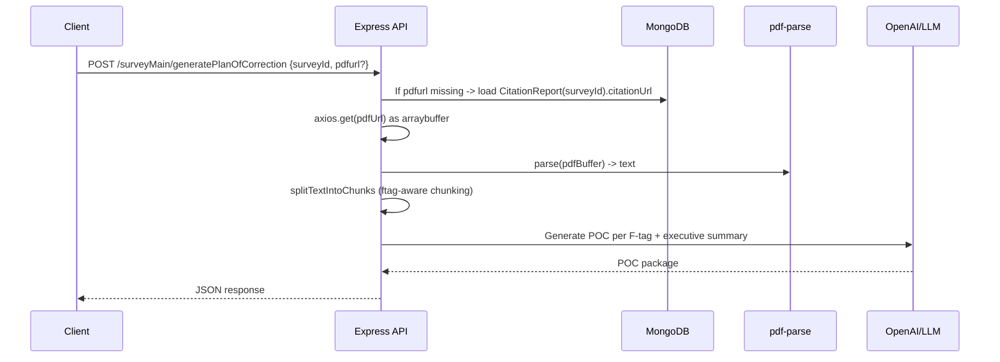
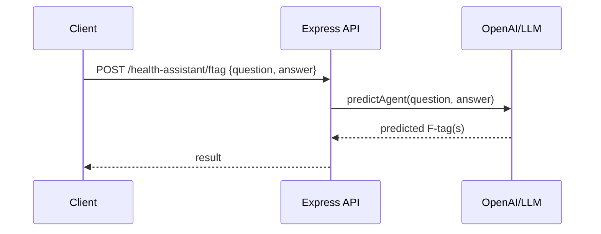
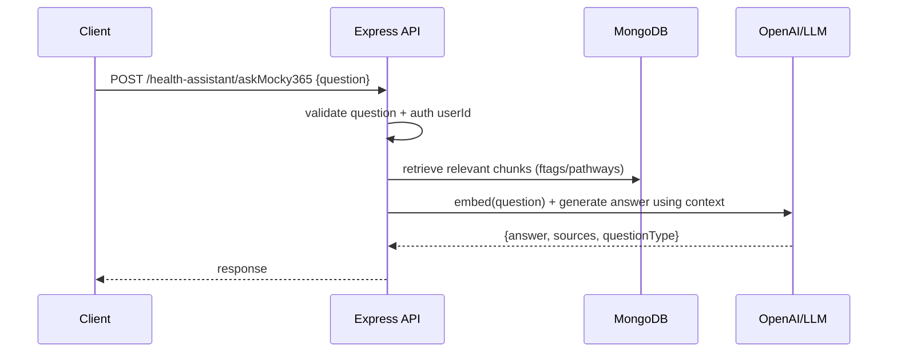

# MockSurvey365 — Architecture & Data Flow (Product View)

**Document Version:** 1.0  
**Date:** 2026-01-21  
**Scope:** Product-focused (repo-accurate), non-deployment-specific where possible  

This document describes the **MockSurvey365 API** architecture and end-to-end data flows based on the current repository implementation.

---

## 1) System Context

MockSurvey365 is a Node/Express API that supports a survey workflow (survey setup → entrance → initial pool → final sample → investigation → citation report → plan of correction) and health-assistant functionality (F-tag prediction and RAG Q&A).

Primary integrations:
- MongoDB (system of record)
- AWS S3 (document storage)
- AWS Textract (table extraction for resident documents)
- OpenAI (LLM reasoning, narrative generation, RAG answer generation)
- Socket.IO (real-time updates)
- Redis (optional locks for multi-instance concurrency)

---

## 2) Logical Architecture (Component Diagram)

```mermaid
flowchart TB
  UI[Web Client] -->|HTTPS REST /api/${VERSION}| API[Express API (app.js/server.js)]
  UI <-->|WSS Socket.IO| API

  API --> AUTH[Auth + RBAC Middleware\ncheck-auth]
  API --> ROUTES[Route Groups\nsurveyMain, surveybuilder, resident,\nhealth-assistant, admin/user/config]

  ROUTES --> SURVEY[Survey Workflow Controller\nsurvey.controller.js]
  ROUTES --> AGENT[Generation Controller\nagent.controller.js]
  ROUTES --> HA[Health Assistant Controller\nhealthAssistant.controller.js]

  AGENT --> IPS[InitialPoolService\ninitialPool.service.js]
  AGENT --> FSS[FinalSampleService\nfinalSample.service.js]
  AGENT --> INV[InvestigationService\ninvestigation.service.js]
  AGENT --> CRS[CitationReportService\ncitationReport.service.js]
  AGENT --> POC[PlanOfCorrectionService\nplanofCorrection.service.js]

  HA --> PRED[predictAgent (F-tag prediction)]
  HA --> RAG[AskMocky365 Agent (RAG Q&A)]

  API --> DB[(MongoDB / Mongoose Models)]
  API --> S3[(AWS S3: uploads + artifacts)]
  IPS --> TEX[Textract\nTABLE extraction]
  FSS --> LLM[OpenAI]
  CRS --> LLM
  POC --> LLM
  RAG --> LLM
  PRED --> LLM

  API -. optional .-> REDIS[(Redis Locks)]
```

---

## 3) API Entry Points (Key)

Routes are mounted in `app.js` under:
- `prefix = /api/${VERSION}`

### Survey lifecycle (SurveyMain)
From `src/routes/surveyMain.router.js`:
- `GET /surveyMain/generateInitialPool/:id`
- `POST /surveyMain/initialPool`
- `GET /surveyMain/viewInitialPool/:id`
- `GET /surveyMain/generateFinalSample/:id`
- `POST /surveyMain/finalSample`
- `GET /surveyMain/viewFinalSample/:id`
- `GET /surveyMain/generateInvestigation/:id`
- `POST /surveyMain/InvestigationResidents`
- `GET /surveyMain/viewInvestigations/:id`
- `GET /surveyMain/generateCitationReport/:id`
- `POST /surveyMain/citationReport`
- `GET /surveyMain/viewCitationReport/:id`
- `POST /surveyMain/generatePlanOfCorrection`
- `POST /surveyMain/planOfCorrection`
- `GET /surveyMain/viewPlanOfCorrections/:id`

### Health assistant
From `src/routes/healthAssistant.router.js`:
- `POST /health-assistant/ftag`
- `POST /health-assistant/askMocky365`

---

## 4) End-to-End Survey Pipeline (Sequence)



---

## 5) Initial Pool Generation (Functional)

Based on `src/services/initialPool.service.js`:

```mermaid
flowchart LR
  A[DocumentsToUpload (surveyId)] --> B[InitialPoolService.generatingInitialResident]
  B --> C[Extract S3 objectKey from docUrl]
  C --> D[Textract StartDocumentAnalysis\nFeatureTypes=TABLES]
  D --> E[Poll Textract Job until SUCCEEDED]
  E --> F[Parse Blocks -> extract residents]
  F --> G[Merge duplicate residents by name]
  G --> H[Append manually added ResidentEntrance]
  H --> I[Strict validation]
  I --> J[AI selection: selectInitialPoolSize]
  J --> K[Return selectedResidents]
```

---

## 6) Final Sample Generation (Functional)

Based on `src/services/finalSample.service.js`:

```mermaid
flowchart LR
  A[InitialPool residents (included=true)] --> B[FinalSampleService.generatingfinalsampleResident]
  B --> C[Normalize residents]
  C --> D[Hard exclusions (included=false)]
  C --> E[Mandatory included (included=true or manually_added)]
  C --> F[Candidate pool = remaining]
  F --> G[LLM analysis (runAIAnalysis) -> insights]
  G --> H[Merge insights -> enrichedCandidates]
  H --> I[Sort by qualityScore desc]
  I --> J[Enforce final sample size = survey.finalSample]
  J --> K[Sanitize output + buildRiskSummary]
  K --> L[Return finalSample + riskSummary]
```

---

## 7) Investigation Generation (Functional)

```mermaid
flowchart TB
  FS[FinalSample Residents] --> INV[InvestigationService]
  INV --> TRIG[Trigger Definitions Map\n(falls, ulcers, meds, infection, etc.)]
  INV --> PATH[CriticalElement Pathways (DB)]
  TRIG --> MATCH[Match resident needs -> triggers]
  PATH --> MATCH
  MATCH --> OUT[Investigation records\nprobe-based structure]
```

---

## 8) Citation Report Generation (Functional)

Based on `src/services/citationReport.service.js`:

```mermaid
flowchart LR
  A[Survey(surveyId)] --> B[CitationReportService.generateCitationReport]
  B --> C[Load InitialAssessmentEntrance]
  B --> D[Load FacilityMandatoryTask]
  B --> E[Load InvestigationData]
  C --> F[Collect noncompliant facility probes]
  D --> G[Collect noncompliant mandatory probes]
  E --> H[Collect investigation probes]
  F --> I[Build issues list for AI]
  G --> I
  H --> I
  I --> J[LLM: generate professional findings per F-tag]
  J --> K[Generate output artifact (e.g., doc)]
  K --> L[Return report metadata]
```

---

## 9) Plan of Correction (POC) Generation (Sequence)

Based on `src/services/planofCorrection.service.js`:



---

## 10) Health Assistant

### 10.1 F-tag prediction



### 10.2 AskMocky365 (RAG Q&A)



---

## 11) Runtime / Deployment Topology (Practical)

```mermaid
flowchart LR
  U[Users / Browser] -->|HTTPS 443| LB[Ingress/ALB/Reverse Proxy]
  U <-->|WSS 443| LB

  LB -->|HTTP to app port| N1[Node/Express Instance(s)\nserver.js + app.js]

  N1 -->|27017 TLS| MDB[(MongoDB)]
  N1 -. optional .-> R[(Redis locks)]
  N1 -->|HTTPS 443| S3[(AWS S3)]
  N1 -->|HTTPS 443| OAI[(OpenAI API)]
  N1 -->|HTTPS 443| TX[(AWS Textract)]
```

---

## 12) Notes / Conventions

- API routes are prefixed by `VERSION` in `app.js`.
- Socket.IO is initialized in `server.js` through `socket.init(server)`.
- Redis is optional; behavior should degrade gracefully if Redis is unavailable.
- Document ingestion for the initial pool is table-driven via Textract in `InitialPoolService`.
